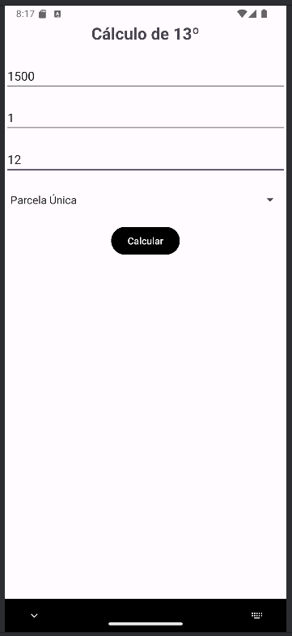
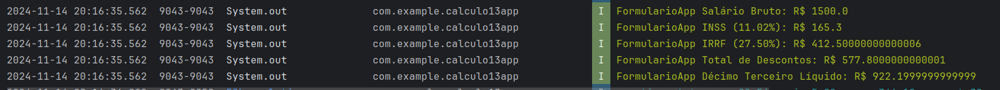

# 13th Salary Calculator App
A simple Android application that calculates the 13th salary based on gross salary input. The app allows users to enter their salary, number of dependents, and months worked, and then performs the calculations for INSS and IRRF deductions, displaying the final net amount of the 13th salary.

## Features
- Input fields for gross salary, dependents, and months worked.
- Spinner to select the desired payment parcel.
- Button to calculate the deductions (INSS and IRRF) and display the net 13th salary.
- Displays results in the Logcat (for demonstration purposes) upon button click.
- Screenshots
- App Interface

### Demo Calculation View

### Log output

## How It Works
- Input the Data: Users fill in the gross salary, number of dependents, months worked, and select the parcel from the spinner.
- Calculate Button: When the "Calculate" button is pressed, the app performs the calculation for:
- INSS: 11.02% of the gross salary.
- IRRF: 27.50% of the gross salary.
- Display Results: The app calculates the net 13th salary by subtracting these deductions from the gross salary. The result is displayed in the Logcat console.